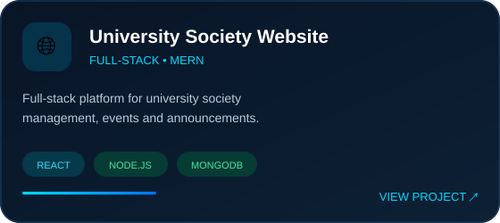
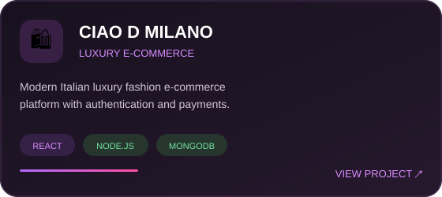
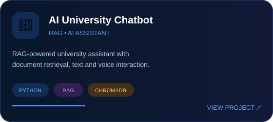
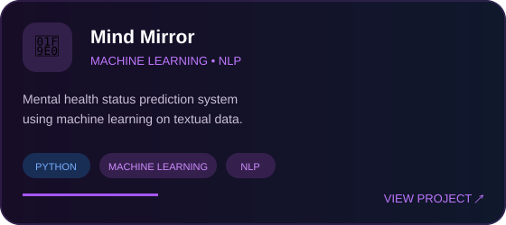

<!-- =====================================================
     SHEHAN VIDURANGA — GITHUB PROFILE README
====================================================== -->

  

# SHEHAN VIDURANGA

### Full-Stack Developer • Machine Learning • DevOps

Building modern web applications, intelligent systems and reliable deployment workflows.

 

&nbsp;

&nbsp;

&nbsp;

&nbsp;

---

## 👨‍💻 About Me

I'm a Computer Science and Technology undergraduate passionate about building modern web applications, intelligent systems, and reliable deployment workflows.

My main areas of interest are:

- 🌐 Full-Stack Development
- 🧠 Machine Learning & Artificial Intelligence
- ⚙️ DevOps & Cloud Technologies
- 🚀 Software Deployment & Automation
- 🔬 Research & Intelligent Systems

---

## 🚀 What I Do

*Building software from idea → intelligence → deployment*

 

<table>
<tr>

<td width="33%" align="center">

### 🌐 Full-Stack Development

  

Building modern, responsive and scalable web applications from frontend interfaces to backend APIs.

  

 

</td>

<td width="33%" align="center">

### 🧠 Machine Learning & AI

  

Creating intelligent systems using machine learning, NLP, RAG and data-driven technologies.

  

 

</td>

<td width="33%" align="center">

### ⚙️ DevOps & Cloud

  

Exploring automated deployment, containerization, CI/CD pipelines and cloud infrastructure.

  

 

</td>

</tr>
</table>

---

## 🛠️ Tech Stack

### 🌐 Full-Stack Development

  

### 🧠 Machine Learning & AI

  

  
  
  
  
  

### ⚙️ DevOps & Cloud

  

  
  
  

---

## 🚀 Featured Projects

Turning ideas into **real-world software, intelligent systems and scalable applications.**

 

 

---

## 🔬 Research & Publication

### 🧠 Mental Health Status Prediction Using Machine Learning on Textual Data

**2nd International Conference on Applied Sciences — ICAPS-SUSL 2026**

*Sabaragamuwa University of Sri Lanka • 2026*

 

  

Machine-learning-based research focused on predicting  
mental health status from textual statements.

  

---

## 📊 GitHub Statistics

<!-- Replace YOUR-STATS-DOMAIN with your working GitHub Readme Stats Vercel domain -->

  

---

## 🎯 Development Focus

*Continuously learning, building and improving across software engineering, AI and modern deployment.*

 

  

### Current Focus

`Full-Stack Applications` • `Machine Learning` • `RAG Systems` • `Docker` • `CI/CD` • `Cloud Deployment`

---

## 🤝 Let's Connect

I'm interested in **Full-Stack Development, Machine Learning, AI and DevOps** opportunities, collaborations and innovative software projects.

 

&nbsp;

&nbsp;

  

  

### 💡 Build • Automate • Learn • Keep Creating

